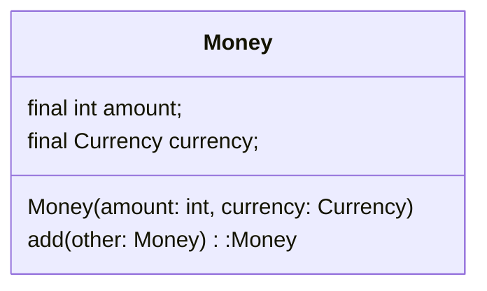

# 3.3:悪魔退治の効果を検証する

ここまでが悪魔退治の基本でした。

TypeScript版を[ここに](../2024-01-20-Sat/readme.md)作成したので、見てみてください。

では,本のMoneyクラスを再度見てみましょう。

`List:3.18:関連ロジックを凝集した変更に強いMoneyクラス`

```java
import java.util.Currency;

class Money {
  final int amount;
  final Currency currency;
  // コンストラクタ
  Money(final int amount, final Currency currency){
    if(amount < 0) {
      throw new IllegalArgumentException("金額には0以上を指定してください。")
    }
    if(currency == null) {
      throw new IllegalArgumentException("通貨単位を指定してください。")
    }
    this.amount = amount;
    this.currency = currency;
  }
  // メソッド
  // 加算
  Money add(final Money other){
    if(!currency.equals(other.currency)){
      throw new IllegalArgumentException("通貨単位が違います。")
    }
    final int added = amount + other.amount;
    return new Money(added, currency);
  }
}
```

`図3.3:Moneyクラス図`



`表3.1:オブジェクト指向による設計効果の検証`

|悪魔|どうなったか|
|:--|:--|
|重複コード|必要なロジックがMoneyクラスに集まっているため、別のクラスに重複コードが書き散らされにくくなった。|
|修正漏れ|重複コード解消に伴い、修正漏れも発生しにくくなった|
|可読性低下|必要なロジックをMoneyクラスに集めているため、デバッグ時や仕様変更時にあちこち関連ロジックを探し回らずに済み、可読性が向上した。|
|生焼けオブジェクト|コンストラクタでインスタンス変数の値を確定し、未初期化状態がなくなった。|
|不正値の混入|不正値を弾くガード節（guard clause）を用意し、インスタンス変数をfinal修飾子で不変にすることで、不正値が混入されないようになった。|
|思わぬ副作用|final修飾子で不変にすることで副作用から解放された。|
|値の渡し間違い|引数をMoney型にすることで、異なる型の値をコンパイラで防止できるようになった。|

さて、冒頭の悪魔退治のクラス要素は

- インスタンス変数
- インスタンス変数を不正状態から防御し、正常に操作するメソッド

でしたね。

クラス設計とは

インスタンス変数を不正状態に陥らせないための仕組み作り、と言っても過言ではありません。

ここで示したMoneyクラスのように、密接に関係し合うロジックが一箇所にぎゅっと集まっている構造を**高凝集**と呼びます。

また、データとそのデータを操作するロジックを１つのクラスにまとめ、必要な手続き（メソッドのこと）のみを外部へ公開することを**カプセル化**といいます。