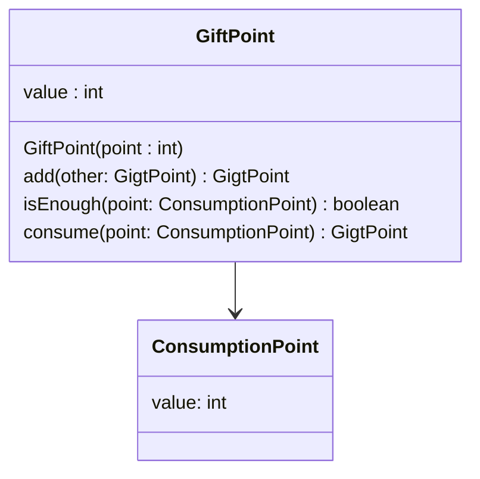
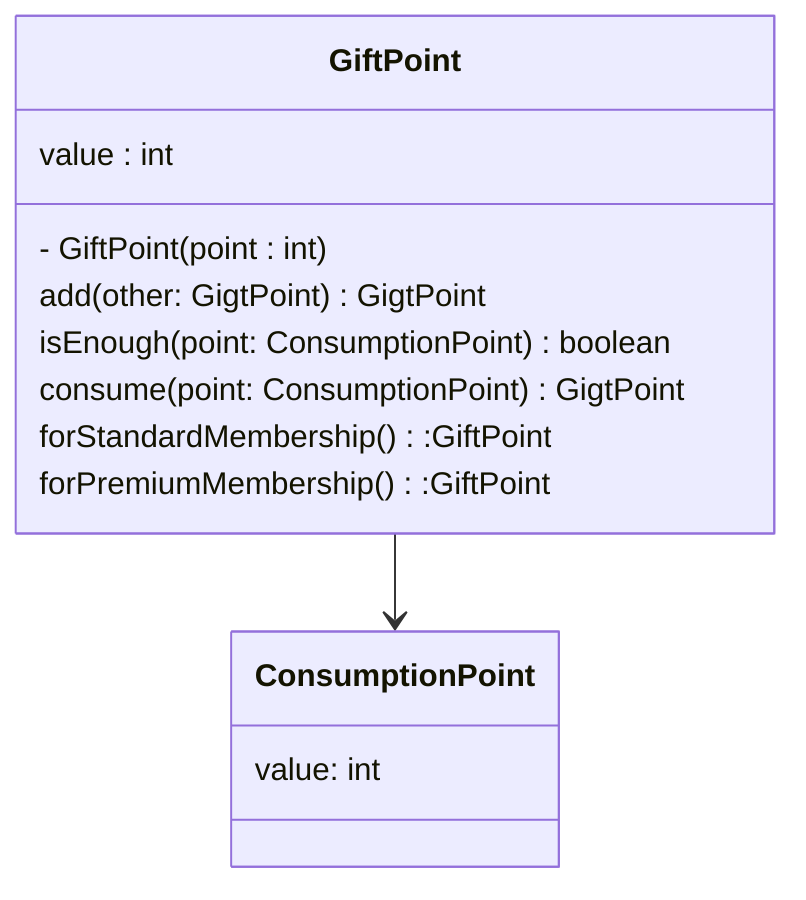

# 5.2:初期化ロジックの分散

十分にクラスを設計しても、初期化ロジックがあちこちに分散して低凝集になってしまう場合があります。

例えば、ECサイトや決済サービスの場合に、新規入会時に無料のお買い物ポイントが付与されるサービスがありますよね？

次のコードは、そうしたギフトポイントを値オブジェクトとして設計したものです。

`List5.4:ギフトポイントを表現するクラス`

```java
class GiftPoint {
  private static final int MIN_POINT = 0;
  final value;

  GiftPoint(final int point){
    if(point < MIN_POINT){
      throw new IllegalArgumentException("ポイントが0以上ではありません。")
    }
    value = point;
  }
  /**
   * ポイントを加算する
   * 
   * @param other 加算ポイント
   * @return 加算後のポイント
   */
  GiftPoint add(final GiftPoint other) {
    return new GiftPoint(value + )
  }
  /**
   * @return 残余ポイントが消費ポイント以上であれば true
   */
  boolean isEnough(final ConsumptionPoint point) {
    return point.value <= value;
  }
  /**
   * ポイントを消費する
   * 
   * @param point 消費ポイント
   * @return 消費後の残余ポイント
   */
  GiftPoint consume(final ConsumptionPoint point) {
    if(!isEnough(point)) {
      throw new IllegalArgumentException("ポイントが不足しています。")
    }
    return new GiftPoint(value - point.value);
  }
}

```

`図5.2:一見凝集性が高く見えるGiftPointクラス`



このGiftPointクラスにはポイントの加算メソッドや消費メソッドが定義されており、ギフトポイントに関するロジックがかなりしっかり凝集されているように見えます。

ところが、、実はそうとは言い切れません。

リスト5.5を見てください。

`List5.5:標準会員の入会ポイント`

```java
GiftPoint standardMemberShipPoint = new GiftPoint(3000);
```

これは、標準会員として新規入会時に3000ポイントを付与する実装です。

また、別の場所にリスト5.6のコードが実装されています。

`List5.6:プレミアム会員の入会ポイント`

```java
GiftPoint premiumMemberShipPoint = new GiftPoint(10000);
```

これはプレミアム会員として新規入会時に10000ポイント付与する実装ですね。

コンストラクタを公開すると、様々な用途に使われがちです。

結果、関連ロジックが分散しがちになり、メンテナンスが大変になります。

例えば、入会ポイントを変更したいときに全ソースをチェックしなければなりません。


## 5.2.1:privateコンストラクタ＋ファクトリメソッドで目的別初期化

こうした初期化ロジックの分散を防ぐには、コンストラクタをprivateにして、代わりに**目的別のファクトリメソッド**を用意します。

`List5.7:ファクトリメソッドを備えたGiftPointクラス`

```java
class GiftPoint {
  private static final int MIN_POINT = 0;
  private static final int STANDARD_MEMBERSHIP_POINT = 3000;
  private static final int PREMIUM_MEMBERSHIP_POINT = 10000;
  final int value;

  // 外部からはインスタンス生成できない
  // クラス内部でのみインスタンス生成できる
  private GiftPoint(final int point) {
    if(point < MIN_POINT){
      throw new IllegalArgumentException("ポイントが0以上ではありません。")
    }
    value = point;
  }
  // 目的ごとにファクトリメソッドを用意した
  /**
   * @return 標準標準会員向け入会ギフトポイント
   */
  static GiftPoint forStandardMembership(){
    return new GiftPoint(STANDARD_MEMBERSHIP_POINT);
  }
  /**
   * @return プレミアム会員向け入会ギフトポイント
   */
    static GiftPoint forPremiumMembership(){
    return new GiftPoint(PREMIUM_MEMBERSHIP_POINT);
  }
  // 省略
}
```

`図5.3:初期化ロジックも凝集したGiftPointクラス`



コンストラクタをprivateにすると、クラス内部でのみインスタンス生成できます。

インスタン生成用のstaticなファクトリメソッドないでコンストラクタを呼び出しましょう。

ファクトリメソッドは目的別に用意しましょう。

`List5.8:標準会員の入会ポイントのファクトリメソッド`

```java
GiftPoint standardMemberShipPoint = GiftPoint.forStandardMembership();
```

`List5.9:プレミアム会員の入会ポイントのファクトリメソッド`

```java
GiftPoint premiumMemberShipPoint = GiftPoint.forPremiumMembership();
```

## 5.2.2:生成ロジックが増え過ぎたらファクトリクラスを検討すること

ものによっては生成ロジックが増えすぎてしまうケースがあります。

すると、クラス内で生成以外のロジックが希薄になって、そのクラスで何がやりたいのかわかりにくくなってしまいます。

生成ロジックがあまりにも長大になるようであれば、**生成専門のファクトリクラスとして分離すること**も検討しましょう。